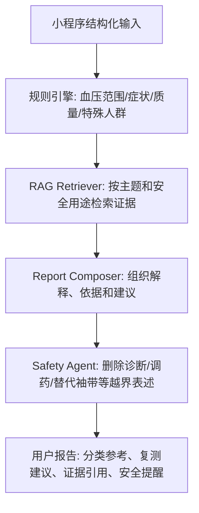

# 工程原理速记：高血压 RAG demo

## 1. 为什么要做 RAG

高血压解释不能只靠大模型自由发挥。RAG 的作用是把回答绑定到可审计来源：指南、官方健康教育、科学声明、测量规范、PPG 局限研究和项目安全规则。这样报告既能解释，又能知道依据来自哪里。

## 2. 知识库分两层

- 可提交层：`source_catalog`、`fulltext_summaries`、`raw/expanded`、`processed/chunks.jsonl`。这是正式入库层，只放摘要化内容和元数据。
- 本地全文层：`sources/downloads` 和 `vector_store`。这层用于本地 demo 检索，不提交 raw PDF 和全文抽取文本。

## 3. 报告生成链路

## 4. 规则引擎、RAG、Safety Agent 的关系

- 规则引擎负责确定性边界：症状危险信号、极高估算值、低质量 PPG、特殊人群、是否建议袖带复测。
- RAG 负责解释依据：为什么要复测、为什么 PPG/无袖带有局限、为什么家庭血压要用验证设备。
- Safety Agent 负责语言收口：不能诊断、不能处方、不能调药、不能给急症 reassurance、不能替代医生。

## 5. 为什么不验证 PPG 准确性

本工程是应用 demo，不是 PPG 血压估算模型验证。准确性验证需要临床参照设备、受试者分层、测量协议、误差统计、校准周期评估和伦理/数据流程。这个 demo 只负责把输入结果解释得更保守、更可追溯、更安全。

## 6. 老师可能追问与回答

- 问：为什么不能直接把所有 PDF 全文入库？答：版权和治理风险高，所以仓库只提交摘要与 metadata；本地全文索引只用于合法下载后的 demo 检索。
- 问：hashing vector 会不会不如 embedding 模型？答：是的，它是 demo 的可复现本地后端；后续可替换为医学 embedding，但检索评估和安全过滤要分开做。
- 问：报告能不能说用户高血压？答：不能。报告只能说估算值落在某参考范围、建议规范袖带复测和就医沟通。
- 问：为什么要单独列授权受限文献？答：说明知识库扩充是合规推进的，哪些材料已摘要、哪些还需机构访问或人工核验都可审计。

